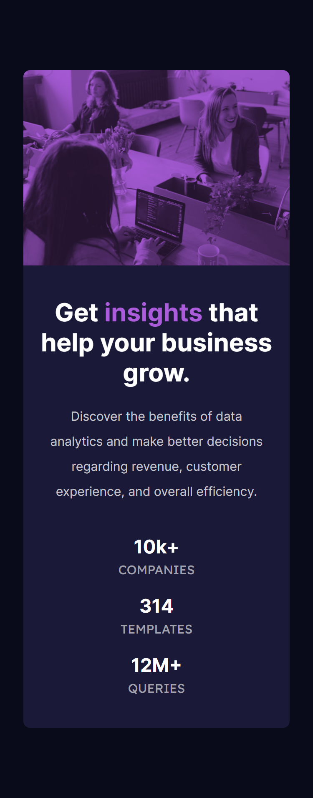
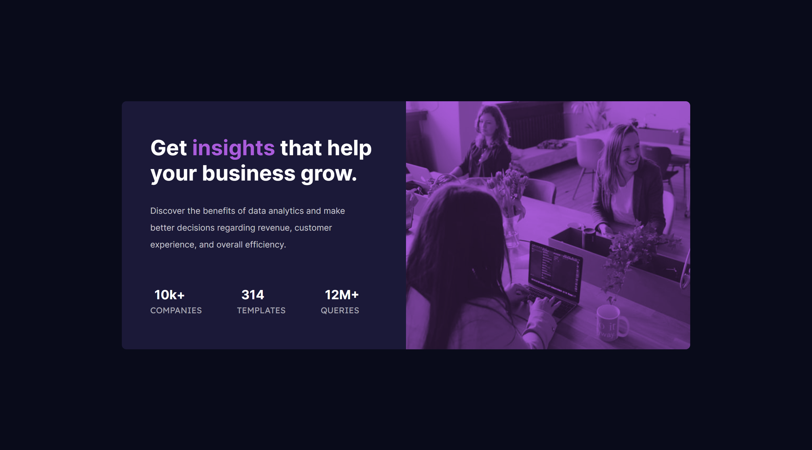

# Frontend Mentor - Stats preview card component solution

This is a solution to the [Stats preview card component challenge on Frontend Mentor](https://www.frontendmentor.io/challenges/stats-preview-card-component-8JqbgoU62). Frontend Mentor challenges help you improve your coding skills by building realistic projects. 

## Table of contents

- [Overview](#overview)
  - [The challenge](#the-challenge)
  - [Screenshot](#screenshot)
  - [Links](#links)
- [My process](#my-process)
  - [Built with](#built-with)
  - [What I learned](#what-i-learned)
  - [Continued development](#continued-development)
- [Author](#author)

## Overview

This is the last challenge in the **Getting Started on Frontend Mentor Beginner roadmap**.

A great challenge to wrap up practice on simple layouts. compared to the previous challenges in the roadmap I found this one to be a lot more difficult to implement.

### The challenge

Users should be able to:

- View the optimal layout depending on their device's screen size

### Screenshot

#### Mobile

#### Desktop

### Links

- Solution URL: [Add solution URL here](https://your-solution-url.com)
- Live Site URL: [Add live site URL here](https://your-live-site-url.com)

## My process

### Built with

- Semantic HTML5 markup
- CSS custom properties
- Flexbox
- CSS Grid
- Mobile-first workflow

### What I learned

As part of this project I learned about CSS blend modes. which allows you to blend multiple backgrounds with each other. or blend elements and their contents with their parent element contents or the element backgrounds.

The two properties that allow you to do this are:
- mix-blend-mode (works on elements and their contents)
- background-blend-mode (works on backgrounds)

It was nice to see that you can apply different effects to images just like in Photoshop and other image editing applications.

I used blending modes to achieve the effect on the image on this challenge.

### Continued development

I found that structuring the html / styles for this project to be much harder than the other ones. it seemed like it had inconsistent spacing thought the layout. and I struggled on how to group content in the html and how to structure my style declarations.

As far I can tell the only way to be better in this is more practice. I stopped working on this project as I reached a state of confusion and I stopped feeling like I'm enhancing the design. and I think it's close enough to the design to stop here.

I'll tackle the next roadmap **Building Responsive Layouts Beginner** next which should offer enough practice to fill these gaps that I'm having.

## Author

- Frontend Mentor - [@ilyesab](https://www.frontendmentor.io/profile/ilyesab)
